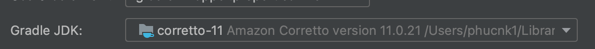

# **Technical documentation for project (Android)**

## **Overview**

This application is serve for a demo
This include 2 screens, first screen is for searching films information, after click in an item it
will navigate to second screen which is display detail information of the chosen film.

## **Guideline**
Project use JDK 11, please change it in your IDE 

First time enter the application it will show blank content because there is no liked film yet.
After typing, search button can be click to search for prompt user had input.
Click on item it will navigate to detail screen, and like action can perform here by click on heart
image.
Press back will show the liked movie just had done
Can show the list of favorites while offline
Also, previous visit time is stored and display when user come back.

## **Architecture**

The project will make use of Clean Architecture to fully support S.O.L.I.D principles.
Clean architecture stands for a group of practices that produce systems that are:

* Independent of Frameworks.
* Testable.
* Independent of UI.
* Independent of Database.
* Independent of any external agency.

The purpose is the separation of concerns by keeping the business rules not knowing anything at all
about the outside world, thus, they can can be tested without any dependency to any external
element.

To achieve this, breaking up the project into 3 different layers, in which each one has its own
purpose and works separately from the others. It is worth mentioning that each layer uses its own
data model so this independence can be reached.

#### **Architecture Considerations** (If needed)

The application is written in  `Kotlin` language and we will be using `MVVM` over `MVP` in the `App`
layer of the application.

#### **Architecture Design** (If needed)

## **API Considerations**

## **Dependency Management**

For Dependency Management we are using `Dagger 2` along with `Android's` native `Binding Library`

## **Libraries**

## **Build and Distrubution**

- Integrating with bitrise

## **Version**

## **References**

> Clean Architecture

* [ProAndroidDev Blog](https://proandroiddev.com/a-guided-tour-inside-a-clean-architecture-code-base-48bb5cc9fc97)
* [Five.Agency](http://five.agency/android-architecture-part-1-every-new-beginning-is-hard/)
* [Fernando Cejas Blog](https://fernandocejas.com/2014/09/03/architecting-android-the-clean-way/)

> Dagger2

* [Ray Wenderlich](https://www.raywenderlich.com/171327/dependency-injection-android-dagger-2)

## **Licensing**
